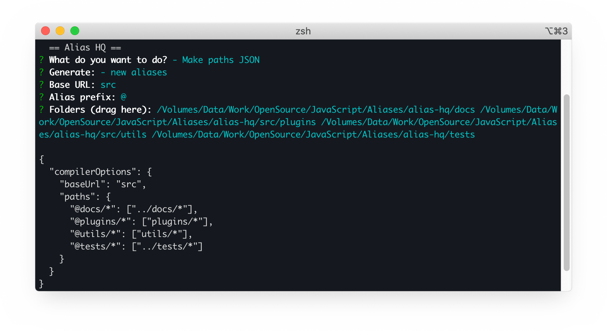

# Alias HQ 


> Manage a single set of folder aliases and convert as-needed to other formats

<p align="center">
  
</p>

## Abstract

### Background

In any non-trivial JavaScript project, developers use path "aliases":

```js
// without aliases
import SomeService from `../../../core/services/some-service`
```
```js
// with aliases
import SomeService from `@services/some-service`
```

The advantage of this is tidier, more intuitive imports, and easier refactoring.

### Problem

At their simplest, aliases are just a map of names and folder paths:

```json
'@app'      : './src/app/'
'@services' : './src/app/services/'
'@utils'    : './src/common/utils/'
...
```

However, tools in the JavaScript ecosystem use a variety of **different** formats:

```js
// typescript, vscode
"@services/*": ["src/app/services/*"]

// webpack, eslint, etc
'@services': '/volumes/projects/path/to/project/src/app/services'

// jest
'^@services/(.*)$': '<rootDir>/src/app/services/$1'

// rollup
{
  find: '@services',
  replacement: '/volumes/projects/path/to/project/src/app/services'
}
```

This forces developers who want to use aliases to duplicate, edit and maintain **separate** configurations for each of these tools in their toolchain.

### Solution

Alias HQ solves this fragmentation by:

- adopting TypeScript / VS Code's [configuration](https://www.typescriptlang.org/docs/handbook/module-resolution.html#path-mapping) as the de facto format
- using your project's [tsconfig.json](https://code.visualstudio.com/docs/typescript/typescript-compiling#_tsconfigjson) or [jsconfig.json](https://code.visualstudio.com/docs/languages/jsconfig) as the "single source of truth"
- providing a plugin architecture to map the configuration to other formats

Note that <strong style="color:red">you don't need to use VS Code <em>or</em> TypeScript to use this library</strong> - it is only the configuration format that is borrowed.

## Setup

### Installation

Install via your package manager of choice:

```bash
npm i --save-dev alias-hq
```
```bash
yarn add -D alias-hq
```

### Configuration

#### Background

Alias HQ piggybacks the TypeScript / VS Code configuration and uses either a `tsconfig.json` or `jsconfig.js` file.

#### Syntax

Locate (or create) the appropriate file in your project's root folder, and configure as per the example below:

```json
{
  "compilerOptions": {
    "baseUrl": "src",
    "paths": {
      "@api/*": ["api/*"],
      "@app/*": ["app/*"],
      "@config/*": ["app/config/*"],
      "@services/*": ["app/services/*"],
      "@utils/*": ["common/utils/*"]
    }
  }
}
```

The configuration requires:

- The `baseUrl` to provide a relative entry point such as  `"."` or `"src"`
- The `paths` to be specified using a [somewhat verbose](https://code.visualstudio.com/docs/languages/jsconfig#_using-webpack-aliases) wildcard and array format

Note that:

- All `paths` should resolve from the `baseUrl`, so something like this is fine: `../node_modules/`
- To resolve folder content, wildcards are required in both `alias` and `path` components
- The format supports [multiple paths](./tsconfig.json), though currently Jest is the only conversion format to utilse this
- You may add non-TypeScript paths (such as assets) here; TypeScript will ignore them but Alias HQ will use them
- You don't *have* to use a `@` character, but the convention is to use one

### Auto-generation

New in 3.1, you can automatically generate the config using the [Alias CLI](#alias-cli):



From your project root:

- Run `node ./node_modules/alias-hq/cli` in the terminal
- Choose "Make paths JSON"
- Choose the prompts that suit you
- Drag in folders from Finder / Explorer
- Copy the resulting JSON to the config file

## Usage

To grab paths in the required format, call `get()` with the plugin name:

```js
import hq from 'alias-hq'

const config = {
  aliases: hq.get('webpack') // use any available plugin name here
}
```

Alias HQ will resolve and return paths in the requested format:

```js
{
  '@api': '/volumes/projects/path/to/project/src/api',
  '@app': '/volumes/projects/path/to/project/src/app',
  '@config': '/volumes/projects/path/to/project/src/app/config',
  '@services': '/volumes/projects/path/to/project/src/app/services',
  '@utils': '/volumes/projects/path/to/project/src/common/utils'
}
```
You can convert to any of the [supported](https://github.com/davestewart/alias-hq/tree/master/src/plugins) formats...

- Webpack
- Rollup
- Jest

...or supply a custom transform function.

## API

### Get paths

#### In supported formats

To convert to a supported format, use the `get()` method, passing the plugin `name`: 

```js
const config = hq.get('jest')
```

If you need to pass custom options, pass an additional hash: 

```js
const config = hq.get('rollup', { format: 'object' })
```

#### Using a custom function

If you need custom transformation, pass a function with the following signature, transform the `paths` data, and return:

```js
function customFormat (paths, options) {
  // your code here
  return ...
}
const config = hq.get(customFormat)
```

See the [contributing](CONTRIBUTING.md) document for more information on writing custom functions.

### Plugins

You can package any custom code via `plugins.add()`, passing the `name` and `callback` function:

```js
hq.plugins.add('custom', customFormat)
```

Then simply `get()` the paths by passing the plugin `name`: 

```js
const config = hq.get('custom')
```

*If you want to submit a custom format as a plugin to the repository, post an issue or PR.*

## Debugging

There might be times when you need to check what is happening under the hood.

#### In code

Check the loaded configuration:

```js
console.log(hq.config)
```

```js
{
  rootUrl: '/volumes/projects/path/to/project',
  baseUrl: 'src',
  paths: {
    '@api/*': [ 'api/*' ],
    '@app/*': [ 'app/*' ],
    '@config/*': [ 'app/config/*' ],
    '@services/*': [ 'app/services/*' ],
    '@utils/*': [ 'common/utils/*' ]
  }
}
```

Check available plugin names:

```js
console.log(hq.plugins.names)
```

```js
[ 'jest', 'rollup', 'webpack' ]
```

Dump configured paths in JSON format for any plugin:

```js
hq.json('jest')
```

```json
{
  "^@api/(.*)$": "<rootDir>/src/api/$1",
  "^@app/(.*)$": "<rootDir>/src/app/$1",
  "^@config/(.*)$": "<rootDir>/src/app/config/$1",
  "^@services/(.*)$": "<rootDir>/src/app/services/$1",
  "^@utils/(.*)$": [
    "<rootDir>/src/common/utils/$1",
    "<rootDir>/src/vendor/utils/$1"
  ]
}
```

#### Alias CLI

The above functionality is also available as an **interactive** CLI.

Just run the following code in the project root, and choose the option you want:

```bash
node ./node_modules/alias-hq/cli
```

```
  == Alias HQ ==
? What do you want to do? (Use arrow keys)
❯ - Show loaded config
  - List plugins output (JS)
  - Dump plugin output (JSON)
  - Make paths JSON
```

```js
{
  rootUrl: '/volumes/projects/path/to/project/',
  baseUrl: 'src',
  paths: {
    '@api/*': [ 'api/*' ],
    '@app/*': [ 'app/*' ],
    '@config/*': [ 'app/config/*' ],
    '@services/*': [ 'app/services/*' ],
    '@utils/*': [ 'common/utils/*', 'vendor/utils/*' ]
  }
}
```

## Integration examples

To get you up and running, here are some common framework integrations:

### VS Code

Simply follow the instructions above, and VS Code should pick up your paths. See the VS Code [documentation](https://code.visualstudio.com/docs/languages/jsconfig#_using-webpack-aliases) for more information.

### WebStorm

The following configuration file can be [used to tell](https://www.jetbrains.com/help/webstorm/using-webpack.html#webpack_module_resolution) WebStorm about your Webpack setup.

Add this file to your project root, and choose it in *Preferences > Languages and Frameworks > JavaScript > Webpack*:

```js
// webpack.config.js
import hq from 'alias-hq'

module.exports = {
  resolve: {
    alias: hq.get('webpack')
  }
}
```

### Webpack

If bundling using Webpack, you can [add the aliases](https://webpack.js.org/configuration/resolve/#resolvealias) using the `resolve.alias` configuration option:

```js
// build.js
import hq from 'alias-hq'

module.exports = {
  ...
  resolve: {
    alias: hq.get('webpack'),
  },
}
```

### Rollup

If bundling using Rollup and @rollup/plugin-alias, you can [add the aliases](https://github.com/rollup/plugins/tree/master/packages/alias#usage) using the `plugins.alias` configuration option:

```js
// rollup.config.js
import hq from 'alias-hq'
import alias from '@rollup/plugin-alias';

module.exports = {
  ...
  plugins: [
    alias({
      entries: hq.get('rollup')
    })
  ]
}
```

You can request rollup paths in `object` or  `array` (the default) format:

```js
hq.get('rollup', { format: 'object' })
```

### Jest

If using Jest, you can [configure](https://jestjs.io/docs/en/configuration#modulenamemapper-objectstring-string--arraystring) the `moduleNameMapper` option:

```js
// jest.config.js
import hq from 'alias-hq'

module.exports = {
  ...
  moduleNameMapper: hq.get('jest'),
}
```

### Vue

If using Vue CLI, you can [add the aliases](https://cli.vuejs.org/guide/webpack.html#simple-configuration) using the `configureWebpack` option:

```js
// vue.config.js
import hq from 'alias-hq'

module.exports = {
  configureWebpack: (config) => {
    ...
    Object.assign(config.resolve.alias, hq.get('webpack'))
  },
}
```

### React

React takes a little more work than the other options, depending on how you are using it.

#### Create React App

Unfortunately, [Create React App](https://create-react-app.dev/) out-of-the-box does not allow path aliases, and will [physically rewrite](https://github.com/davestewart/alias-hq/issues/1#issuecomment-680005750) your config if you attempt to use them.

To work around this, at least two options are:

- **[eject](https://create-react-app.dev/docs/available-scripts/#npm-run-eject) the configuration** and manually add Alias HQ to `config/webpack.config.js` *(see above)*
- **use something like [React App Rewired](https://github.com/timarney/react-app-rewired)** to enable the webpack setup to be manually tweaked *(see below)*

#### React App Rewired

To prevent Create React App from rewriting your `tsconfig`:

1. Rename your `tsconfig.json` file as `tsconfig.base.json`
2. Create a new `tsconfig.json` file and save the following:

```json
{
  "extends": "./tsconfig.base.json",
  "compilerOptions": {}
}
```

To set up React App Rewired:

1. Follow the [installation instructions](https://github.com/timarney/react-app-rewired#how-to-rewire-your-create-react-app-project) to install in your project
2. Set up the ``config-overrides.js`` file as follows:

```js
const hq = require('alias-hq')

module.exports = function override(config, env) {
  Object.assign(config.resolve.alias, hq.get('webpack'))
  return config;
}
```

This short React guide is *not meant to be exhaustive*; for issues, use your common sense, search Google, and see the appropriate package's issues.

### JSON-only configurations

Use the [debugging](#debugging) options above, then copy / paste the JSON where you need it.

## Contributing

If you want a specific framework or library supported, check the [contributing](./CONTRIBUTING.md) document or create an [issue](https://github.com/davestewart/alias-hq/issues).