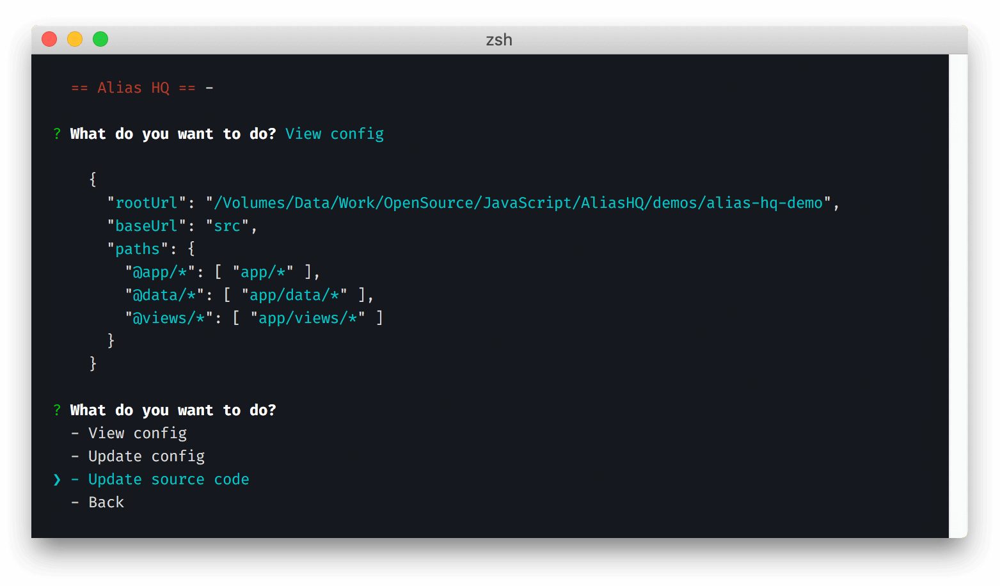

# Alias HQ 


> The end-to-end solution for configuring, refactoring, maintaining and using path aliases

<p align="center">
  
</p>

## TL;DR

If you are *considering* using aliases:

- Alias HQ **writes the config for you** then **refactors your project's imports** 

if you are *already* use aliases:

- Alias HQ **uses only your jsconfig** file with **one-liner conversion** to Jest, Webpack, Rollup, etc

## Abstract

Path "aliases" are `@identifiers` that simplify unwieldy or lengthy file `imports`:

```js
// from this
import { fooify } from '../../../core/services/foo' 

// to this
import { fooify } from '@services/foo' 
```

**Using aliases in your projects makes your code easier to read and maintain.**

They are widely supported in the JavaScript ecosystem, but:

- libraries have incompatible formats so require separate configurations  
- maintaining duplicate configurations is fiddly and error-prone 
- migrating source code is laborious and long-winded

Alias HQ solves these problems by:

- using your project's `js/tsconfig`'s `paths` as the [single source of truth](./docs/setup.md)
- providing a user-friendly [CLI](docs/cli.md) to generate `config` *and* refactor `src/*` code
- providing a one-liner [API](docs//api.md) for [Webpack](docs/integrations.md#webpack), [Jest](docs/integrations.md#jest), [Rollup](docs/integrations.md#rollup) and [more](docs/plugins.md)

## Getting started



You can configure and refactor any sized project *from scratch* in **under 30 seconds** by installing the package, running the CLI, and answering the prompts.

For more detailed instructions, see:

- [Setup](docs/setup.md)
- [CLI](docs/cli.md)
- [Integrations](docs/integrations.md)

For information about the API, see:

- [API](docs/api.md)
- [Plugins](docs/plugins.md)


