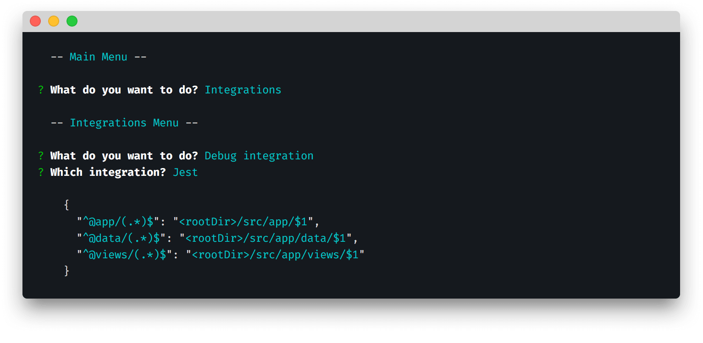

# CLI - Integrations

> Debug paths configuration for available integrations



The Integrations menu allows you to:

- [Configure integration](#configure-integration) - instructions on how to configure Webpack, Jest, etc
- [Debug integration](#debug-integration) - view the output of integrations to debug or use as JSON 

## Configure integrations

This menu shows you the documented list of integrations:

```
? What do you want to do? Configure integration
? Integration:
❯ - VS Code
  - WebStorm
  - Webpack
  - Rollup
  - Jest
  - Vue
  - React
  - JSON-only
```

They simply [link](./integrations.md) to this documentation and provide specifics of setting up each IDE / framework / lib.

## Debug integration

This menu lets you choose from the available plugins (currently Webpack, Rollup, Jest) and any available format options, then prints the results:

```
? What do you want to do? Debug integration
? Which integration? Rollup
? Which format? Array

    [
      {
        "find": "@app",
        "replacement": "/Volumes/Data/AliasHQ/demos/alias-hq-demo/src/app"
      },
      {
        "find": "@data",
        "replacement": "/Volumes/Data/AliasHQ/demos/alias-hq-demo/src/app/data"
      },
      {
        "find": "@views",
        "replacement": "/Volumes/Data/AliasHQ/demos/alias-hq-demo/src/app/views"
      }
    ]

```

You can use this to:

- see the raw output to debug a paths problem
- copy and paste if you need hardcoded JSON
- help develop and debug your own [plugins](./plugins.md)


---

> » Next: [Plugins](./plugins.md)

