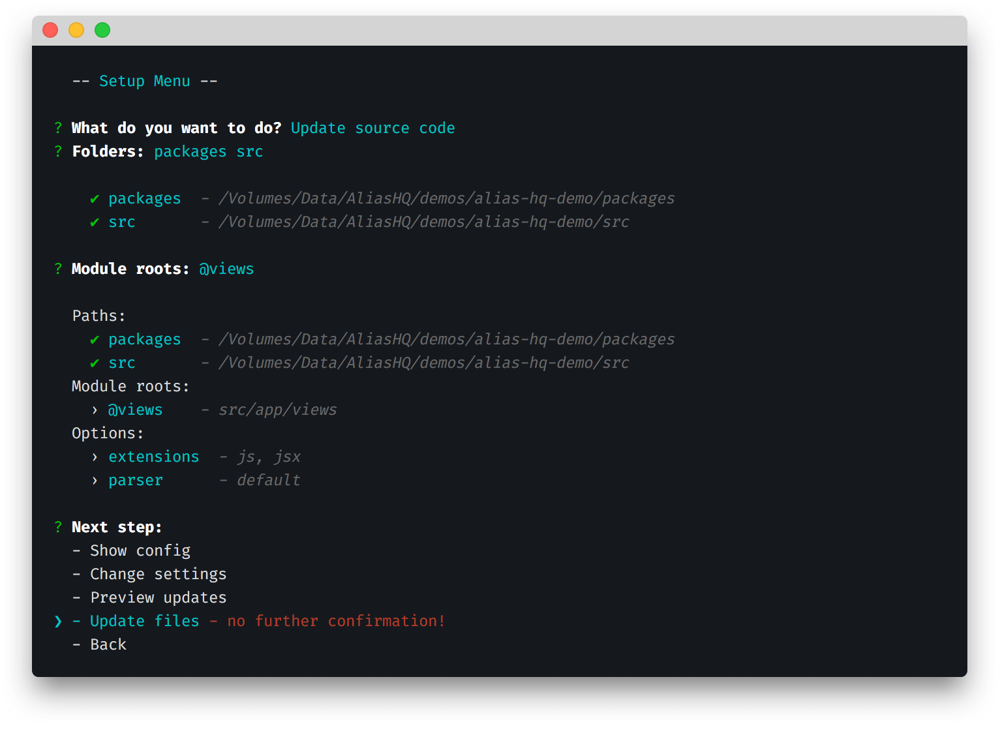

# CLI

> Command line tool to generate configuration, rewrite source code, and debug plugins



## Overview

The Alias HQ CLI is designed to make the configuration and refactoring your project as simple as picking some options, and hitting enter.

In the terminal, run the following code:

```bash
alias-hq
```

You will see (depending on the configured state of your project):

```
? What do you want to do?
❯ - Setup         - update config and source code
  - Integrations  - configure and debug library integrations
  - Help          - read the docs
  - Exit
```

Choose from the available options:

- [Setup](./cli-setup.md) - update config and source code
- [Integrations](cli-integrations.md) - configure and debug library integrations

*If the CLI does not run at all, see the [troubleshooting](#troubleshooting) section.*

## Troubleshooting

If you can't get the CLI to run, ensure that local `node_modules` executables are in your `~/.bash_profile` or equivalent: 

```bash
export PATH=./node_modules/.bin:$PATH
```

If you still can't get the path setup working, you can just call the CLI directly:

```bash
./node_modules/.bin/alias-hq
```


---

> » Next: [CLI - Setup](./cli-setup.md) or [API](./api.md)

