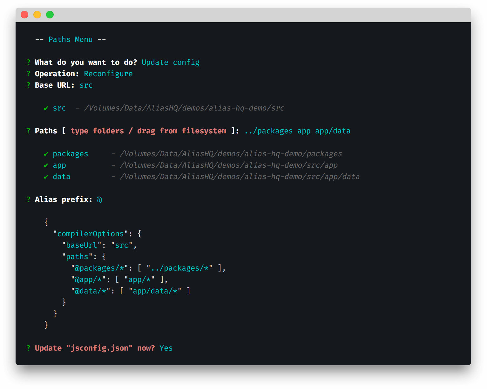

# Configure paths

> Create and maintain your paths configuration



Alias HQ piggybacks the Microsoft-designed `ts/jsconfig.json` configuration files.

These describe a wide variety of options designed for JavaScript and TypeScript projects, and will be familiar to VS Code users, **though you do not have to use VS Code to use Alias HQ.**

Alias HQ transparently reads and writes from this single config file for all API and CLI operations. 

*See the [notes](#notes) section at the end for more information on the configuration format.*

## Create config

If you do not already have a `ts/jsconfig.json` file, Alias HQ can create one for you.

Follow the prompts and you will end up with a basic file like this:

```json
{
  "compilerOptions": {
    "baseUrl": "",
    "paths": {}
  }
}
```

## Update config

The next menu option lets you configure your project's path aliases.

It has three steps: **Base Url**, **Paths** and **Alias Prefix**.

### Base URL

The `baseUrl` is folder from which all `paths` will start from, and is generally either:

-  your `src/` folder (pre-filled if this folder exists)
- your root folder (just enter `.` )

### Paths

Your `paths` config is the physical map of alias `names` to file system folders.

You have various ways to enter them:

- type folder paths, relative to your `baseUrl` folder
- drag-and-drop folders (absolute paths) from your Finder / Explorer
- copy/paste relative or absolute paths. 

Note that:

- the paste limit is often 1024 characters
- line breaks do not seem to be supported
- separate paths with spaces instead, quoting if necessary

Alias HQ will process your input then show you a preview of valid paths (those that exist, and are below the project root):

```
? Paths [ type folders / drag from filesystem ]: ../packages app foo

    ✔ packages      - /Volumes/Data/AliasHQ/demos/alias-hq-demo/packages
    ✔ app           - /Volumes/Data/AliasHQ/demos/alias-hq-demo/src/app
    ✘ foo           - /Volumes/Data/AliasHQ/demos/alias-hq-demo/src/foo
```

You cannot continue with invalid paths; they will be removed and you will have to repeat the step.

### Alias prefix

Finally, you will want to *prefix* your aliases.

The convention is `@` and is the default suggestion.

### Preview config

Once you complete these steps, Alias HQ will show you a preview of the new configuration and give you the option to save it:

```js
{
  "rootUrl": "/Volumes/Data/AliasHQ/demos/alias-hq-demo",
  "baseUrl": "src",
  "paths": {
    "@packages/*": [ "../packages/*" ],
    "@/*": [ "/*" ],
    "@app/*": [ "app/*" ],
    "@data/*": [ "app/data/*" ],
    ...
  }
}
```

## Notes

The configuration requires:

- The `baseUrl` to provide a relative entry point such as  `"."` or `"src"`
- The `paths` to be specified using Microsoft's [somewhat verbose](https://code.visualstudio.com/docs/languages/jsconfig#_using-webpack-aliases) wildcard and array format

Note that:

- All `paths` should resolve from the `baseUrl`, so something like this is fine: `../node_modules/`
- To resolve folder content, wildcards are required in both `alias` and `path` components
- The format supports [multiple paths](https://www.typescriptlang.org/tsconfig#paths), though currently Jest is the only conversion format to utilise this
- You may add non-TypeScript paths (such as assets) here; TypeScript will ignore them but Alias HQ will use them
- You don't *have* to use a `@` character, but the convention is to use one