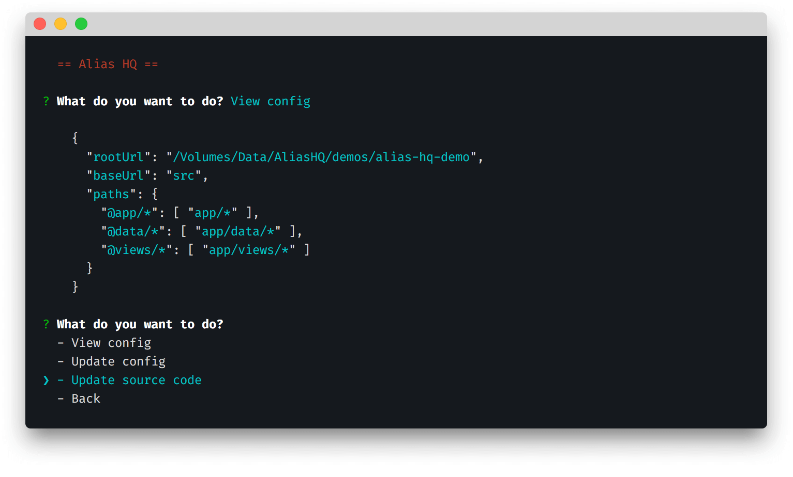

# Quick start

> Configure your project to use path aliases in your toolchain

## Overview

It's a couple of simple steps to get up and running with Alias HQ:

1. [Configure](#configuration) path aliases
2. [Integrate](#integration) target frameworks

From version 4.1, configuration can be completed using the [Alias CLI](cli/cli.md):



This interactive session of questions and prompts lets you:

- [configure](#configuration) your paths and aliases for the first time
- [integrate](#integration) with tools like Webpack, Jest, etc
- [update](#update-source-code) your project's source code

Open the terminal at your project root, type the following:

```
alias-hq
```

*If you have any issues, check the [troubleshooting](cli/cli.md#troubleshooting) section.*

## Setup

Once up and running, follow the steps below.

### Configuration

> *Visit [Configure paths](./cli/paths.md) for full docs*

If you don't yet have a `ts/jsconfig.json` file:

- Choose "Configure paths > Create config"
- Choose "JavaScript" or "TypeScript" as required
- Choose to save the file

To add or update paths in your config file: 

- Choose "Configure paths > Update config"
- Choose your "Base URL"
- Choose "Folders" by typing relative paths, or dragging in folders from Finder / Explorer
- Choose an "Alias prefix"
- Choose to save the config

### Integration

> *Visit [Setup integrations](./cli/integrations.md) for full docs*

To set up tooling or frameworks like Webpack and Jest:

- Choose "Setup integrations > Setup integration"
- Choose an integration from the list
- Follow the instructions

If you want to do this manually, see the [Integrations](integrations.md) document

## Update source code

> *Visit [Update source code](./cli/source.md) for full docs*

To update source code with your new aliases:

- Choose "Update source code"
- Choose "Configure options"
- Type the relative paths of the folders you want to update
- Choose any [module roots](./cli/source.md#module-roots) from the list 
- Choose to "Preview updates" or "Update files"

