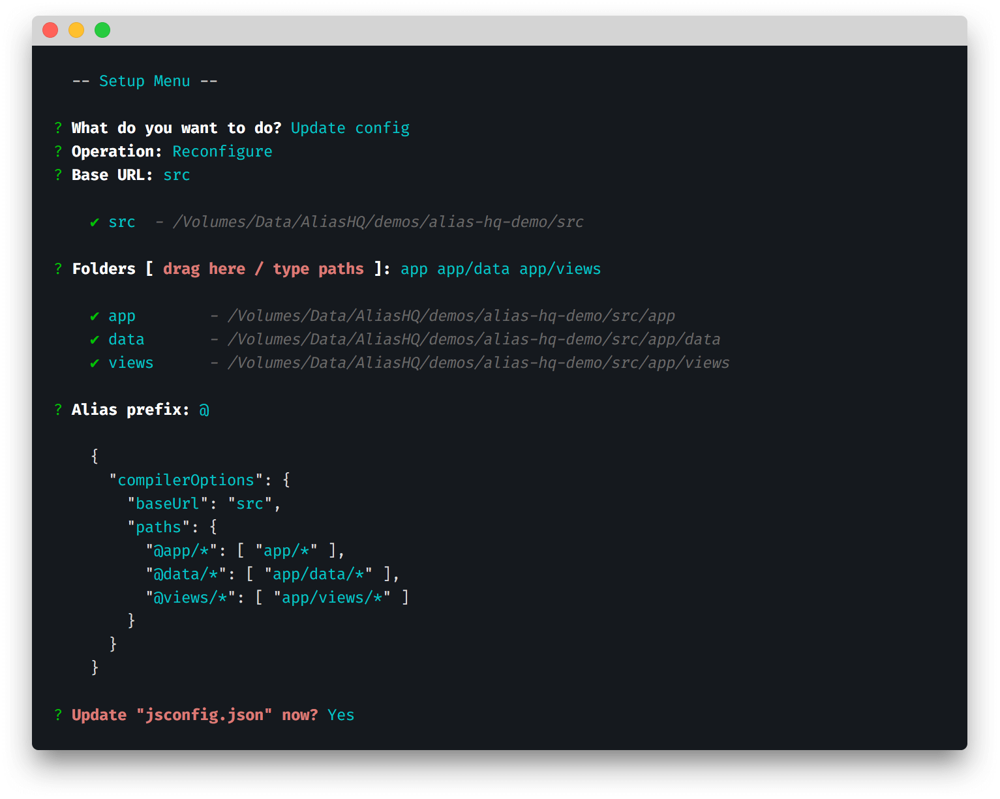

# Setup

> Configure your project to use path aliases in your toolchain

## Installation

Install via your package manager of choice:

```bash
npm i --save-dev alias-hq
```
```bash
yarn add -D alias-hq
```

## Configuration

### Background

Alias HQ piggybacks the Microsoft-designed `ts/jsconfig.json` configuration files.

These describe a wide variety of options designed for JavaScript and TypeScript projects, and will be familiar to VS Code users, though you do not have to use VS Code to use Alias HQ.

### Get started

From version 3.1, you can generate the config via the [Alias CLI](./cli.md):



#### Run the CLI

In the terminal:

- From your project root, type and run `alias-hq`

*If this doesn't work, see the [troublshooting](./cli.md#troubleshooting) section in the CLI docs.*

#### Create a new config file

If you don't yet have a config file:

- Choose "Setup > Create config"
- Choose "JavaScript" or "TypeScript" as required
- Choose to save the file

#### Add paths to an existing config file

To add or update paths in your config file: 

- Choose "Setup > Update config"
- Choose your "Base URL"
- Choose "Folders" by typing relative paths, or dragging in folders from Finder / Explorer
- Choose an "Alias prefix"
- Choose to save the config

See the [CLI](./cli.md) document for more info / troubleshooting.

## Notes

The configuration requires:

- The `baseUrl` to provide a relative entry point such as  `"."` or `"src"`
- The `paths` to be specified using Microsoft's [somewhat verbose](https://code.visualstudio.com/docs/languages/jsconfig#_using-webpack-aliases) wildcard and array format

Note that:

- All `paths` should resolve from the `baseUrl`, so something like this is fine: `../node_modules/`
- To resolve folder content, wildcards are required in both `alias` and `path` components
- The format supports [multiple paths](https://www.typescriptlang.org/tsconfig#paths), though currently Jest is the only conversion format to utilise this
- You may add non-TypeScript paths (such as assets) here; TypeScript will ignore them but Alias HQ will use them
- You don't *have* to use a `@` character, but the convention is to use one


---

> » Next : [CLI](./cli.md)

